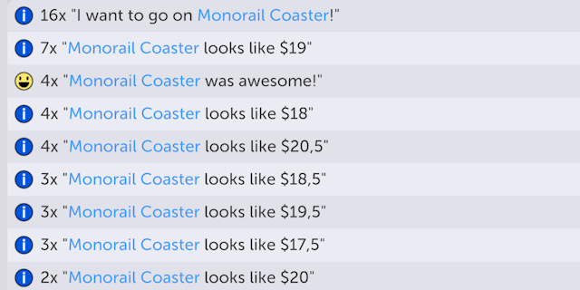

# What It's Worth

This mod shows guests' thoughts about rides' entry fees. Just like that:

You might use this mod to gain a better understanding on how guests' perception of value varies
and how to price the ride entry fees better.

## Setting Up

- Clone the repository
- Copy Parkitect DLLs from `Parkitect/Parkitect_Data/Managed` to `Libs/`
- Download [Harmony](https://github.com/pardeike/Harmony/releases/tag/v2.2.2.0) and copy `net472/0Harmony.dll` to `Libs/`

## Building

Open the Visual Studio project and compile. Post-build event should automatically copy the necessary files to the game's `Mods` sub-directory inside My Documents.

## Credits
- Mod by [YellowAfterlife](https://yal.cc).
- Big thanks to [TransformAnarchy](https://github.com/MrUnit64/TransformAnarchy) (from which I was able to borrow some of the boilerplate) and distantz in particular for linking resources.

